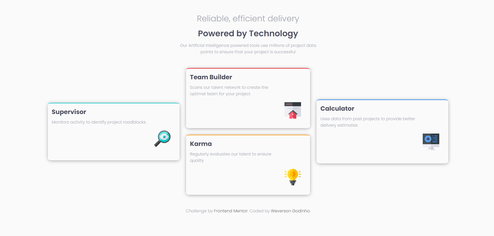

# Frontend Mentor - Four card feature section solution

This is a solution to the [Four card feature section challenge on Frontend Mentor](https://www.frontendmentor.io/challenges/four-card-feature-section-weK1eFYK). Frontend Mentor challenges help you improve your coding skills by building realistic projects. 

## Table of contents

- [Overview](#overview)
  - [The challenge](#the-challenge)
  - [Screenshot](#screenshot)
  - [Links](#links)
- [Author](#author)

## Overview

### The challenge

Users should be able to:

- View the optimal layout for the site depending on their device's screen size

### Screenshot

### Links

- [GitHub Repository](https://github.com/Godinhoweverson/four-card-feature-)
- [Live Site URL:](https://godinhoweverson.github.io/four-card-feature-/)

### Built with

- Semantic HTML5 markup
- CSS custom properties
- Flexbox

## Author

- [GitHub](https://github.com/Godinhoweverson)
- Frontend Mentor - [@Godinhoweverson](https://www.frontendmentor.io/profile/Godinhoweverson)
